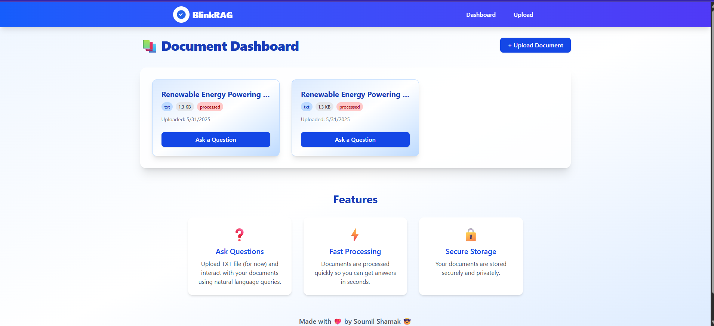
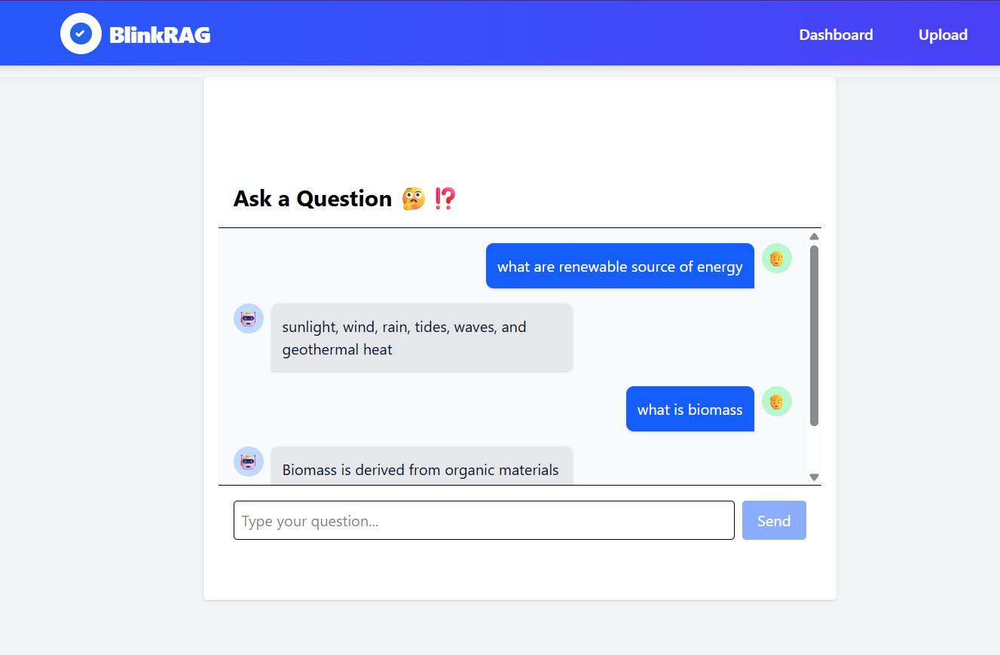
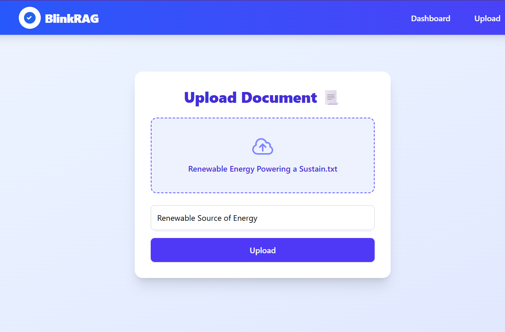

# ✨ **BlinkRAG – Document Intelligence RAG App**

> - 🧠 **BlinkRAG** is a full-stack app to upload documents, chunk & embed them into a vector DB, and ask natural language questions – answered in real-time by Gemini 2.0 AI.
> - 💻 **Tech:** Django, Gemini 2.0, Vite + React, Tailwind CSS, ChromaDB
> - ✨ **Style:** Clean. Minimal UI

---

## 🚀 **Features**

- ✅ Upload `.txt` files
- ✅ Auto-chunk & embed with **Sentence Transformers**
- ✅ **ChromaDB** for fast semantic search
- ✅ Gemini 2.0 Flash answers 🔥
- ✅ Chat-like Q\&A interface
- ✅ Responsive design – looks fab on mobile too! 📱

---

## 🛠️ **Tech Stack**

<p align="center">
  
  
  
  
</p>

---

## 📂 **Project Structure**

```
BlinkRAG/
├── backend/              # Django backend
├── frontend/             # Vite + React frontend
├── sample_test_files/    # Sample files for testing
├── UI/                   # Screenshots of UI
└── README.md
```

---

## ✨**UI**
<p align="center">
  
  
  
</p>

## 🌐 **API Endpoints**

| Endpoint          | Method | Description               |
| ----------------- | ------ | ------------------------- |
| `/api/upload/`    | POST   | Upload document           |
| `/api/documents/` | GET    | List uploaded docs        |
| `/api/ask/`       | POST   | Ask question to Gemini 🤖 |

---

## ⚙️ **Getting Started**

### **Clone Repo**
```bash
git clone https://github.com/shamak24/BlinkRAG.git
```

### 🔧 **Backend**

```bash
python -m venv venv
source venv/bin/activate  # or venv\Scripts\activate
pip install -r requirements.txt
python manage.py migrate
python manage.py runserver
```

### 🖥️ **Frontend**

```bash
cd frontend
npm install
npm run dev
```

---

## 🔑 **Setup Tips**

- ✅ **CORS**: Set `CORS_ALLOW_ALL_ORIGINS=True` in Django
- ✅ **API Key**: Add your `GEMINI_API_KEY` in `.env`

---

## 💡 **Why BlinkRAG?**

- Because Gen Z wants answers fast ⚡.
- Because your doc insights shouldn’t gather dust 📚.
- Because AI is better when it’s conversational. 🎤

---
## ⁉️**Sample Questions and Answers generated by System**
- **Question** - What phrase sums up the ideals of the French Revolution?
**Answer** - Liberty, equality, and fraternity.
- **Question** - What year did the French Revolution start?
**Answer** - 1789
- **Question** - What was one cause of the French Revolution?
**Answer** - Economic hardship
- **Question** - Why renewable source of energy?
**Answer** - Renewable energy sources produce little to no greenhouse gases or pollutants, making them vital for combating climate change and reducing air pollution.
- **Question** - What is biomass
**Answer** - Biomass is derived from organic materials like plants and waste.


---
<p align="center">Made with ❤️ by Soumil Shamak 😎</p>
